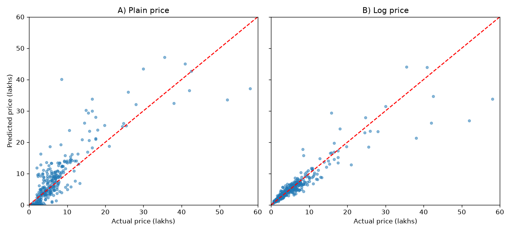
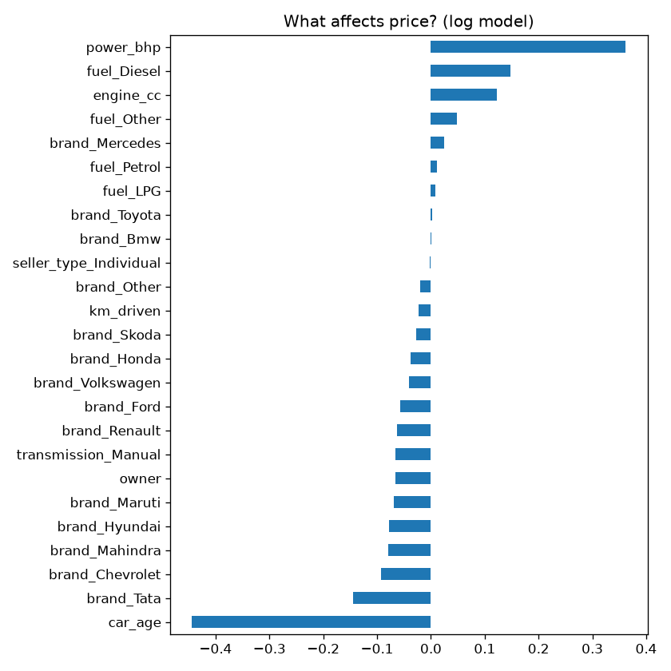

# 🚗 Car Price Prediction Using Machine Learning

This project predicts the selling price of used cars using Machine Learning and Linear Regression.

## 📌 Project Objective

The main objective of this project is to predict the price of a used car based on its features such as:

- Brand
- Car Age
- Kilometers Driven
- Owner
- Engine Capacity
- Power
- Fuel Type
- Seller Type
- Transmission

## 🛠️ Technologies Used

- Python
- Pandas
- NumPy
- Matplotlib
- Linear Regression
- Machine Learning

## 🔄 Project Workflow

Dataset
↓
Data Cleaning
↓
Feature Engineering
↓
Categorical Encoding
↓
Train-Test Split
↓
Feature Scaling
↓
Linear Regression
↓
Log Price Transformation
↓
Prediction
↓
Model Evaluation

## 🤖 Machine Learning Model

Linear Regression is used to predict the car selling price.

Two approaches were tested:

1. Linear Regression using original price
2. Linear Regression using log-transformed price

The log-price model performed better.

## 📊 Model Performance

| Model | R² | MAE | RMSE |
|---|---:|---:|---:|
| Plain Price | 0.611 | 3.047 | 4.720 |
| Log Price | **0.832** | **1.437** | **3.099** |

The final model achieved an R² score of **0.832**.

## 📈 Results

### Actual vs Predicted Price



### Feature Coefficients



## 🚘 Example Prediction

Example input:

- Brand: Maruti
- Age: 8 years
- Kilometers: 60,000
- Owner: 1
- Engine: 1197 cc
- Power: 82 bhp
- Fuel: Petrol

Predicted Price:

**₹5.77 Lakhs**

## ▶️ How to Run

Clone the repository:

```bash
git clone https://github.com/Vedant1427/car-price-prediction.git
